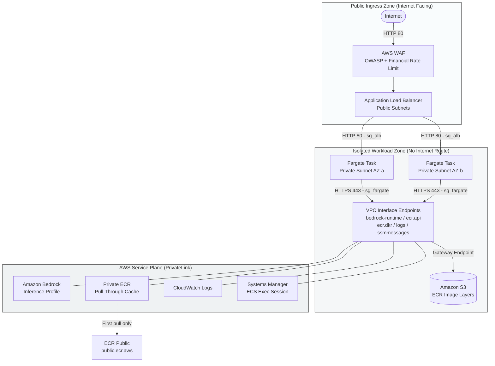

# AWS Secure AI Workload — ECS Fargate + Amazon Bedrock

## Executive Summary

AI inference workloads introduce two coupled operational risks: uncontrolled data egress and unpredictable token consumption costs. The default architecture — routing model API traffic over the public internet via NAT gateways — expands the attack surface, complicates data governance, and exposes organisations to unbounded LLM costs if endpoints are abused.

This project demonstrates a security-focused, zero-egress AWS architecture — designed as a portfolio-grade implementation — where all AI inference traffic remains strictly within the AWS network backbone via AWS PrivateLink. The workload runs on AWS ECS Fargate behind a WAF-protected Application Load Balancer (ALB), interacts with Amazon Bedrock via private VPC endpoints, and enforces granular cost attribution through tagged inference profiles.

This repository is the result of a deliberate refactoring exercise. A traditional "Secure VPC" baseline (Bastion Host + EC2 + RDS) was systematically dismantled and re-architected against a strict mandate: **minimise operational ownership, eliminate permanent attack surfaces, and reduce fixed infrastructure costs.**

### Infrastructure Evolution

| Legacy Component | Cloud-Native Replacement | Architectural Rationale |
|---|---|---|
| **Bastion Host** | ECS Exec (AWS Systems Manager) | Eliminates SSH, port 22 exposure, and key management overhead. |
| **EC2 Instance** | ECS Fargate | Removes OS patching, instance lifecycle management, and shifts to a pure pay-per-use compute model. |
| **RDS MySQL** | *(Removed)* | Eliminated persistent idle database costs; decoupled state from the inference pipeline. |
| **NAT Gateway** | VPC Interface Endpoints | Restricts egress to the AWS backbone; removes default routes to the public internet. |

---

## Design Requirements & Constraints

The target architecture was designed to satisfy a strict matrix of enterprise constraints:

* **Data Sovereignty:** Zero outbound internet routing from the application subnets.
* **Zero-Trust Access:** No permanent inbound management ports (no SSH, no RDP).
* **Serverless Operations:** Maximise managed services to eliminate OS-level patching and maintenance.
* **High Availability:** Multi-AZ deployment across independent Availability Zones.
* **FinOps Governance:** Granular cost tracking per workload for LLM consumption and zero idle costs for non-utilised resources.

---

## Architecture Overview

The architecture enforces strict network isolation, isolating public-facing ingress from private compute resources and internal AWS services.



---

## Design Decisions

| Decision | Rationale |
|---|---|
| **ECS Fargate over EC2** | Removes instance lifecycle management (patching, AMI, OS monitoring). Per-second billing matches the variable load profile of an AI inference workload. |
| **VPC Interface Endpoints over NAT Gateway** | Traffic to Bedrock, ECR, CloudWatch, and SSM never leaves the AWS network. Reduced attack surface; no default internet route in private subnets. Cost-equivalent to a NAT gateway at this service volume. |
| **Gateway Endpoint S3 (free)** | ECR stores image layers on S3. Without this gateway, image pulls fail even when ECR endpoints are correctly configured — a silent, hard-to-diagnose failure. |
| **ECR Pull-Through Cache over direct pull** | ECR Public (`public.ecr.aws`) is not reachable via VPC endpoints. A direct pull from a VPC without NAT produces `CannotPullContainerError`. The pull-through cache promotes a public image to a private registry, reachable via existing endpoints. |
| **WAF rate-based rule** | Dual purpose: security (brute force, L7 DDoS) and financial protection. A bot hammering the endpoint generates Bedrock token charges — the rate limit cuts traffic before costs escalate ("denial of wallet"). |
| **Execution Role / Task Role separation** | The execution role is used by ECS to start the task (pull image, write logs). The task role is used by the application inside the container. A compromised container yields task role permissions (scoped), not execution role permissions. |
| **Bedrock Application Inference Profile** | Without an inference profile, all Bedrock calls appear as a single generic line in Cost Explorer. A tagged profile (`Project`, `CostCenter`) enables per-workload cost attribution without custom instrumentation. |
| **ECS Exec over Bastion Host** | A bastion exposes port 22 permanently, requires distributed SSH keys, and creates a persistent attack surface in the public subnet. ECS Exec opens an encrypted SSM channel on demand — no open ports, no keys. |
| **Deployment Circuit Breaker with rollback** | If a new task definition revision fails ALB health checks, ECS automatically rolls back to the previous revision. Prevents sustained downtime from a failed deployment. |
| **ALB in public subnet — Fargate in private subnets** | The ALB absorbs public traffic and applies the WAF before forwarding to Fargate. Tasks have no public IPs and no internet route. Only the ALB is internet-facing. |

---

## Traffic Flow

```
[Client]
   │
   ▼
[WAF — Web ACL]          ← OWASP rules + Known Bad Inputs + Rate limit (100 req/5min/IP)
   │
   ▼
[ALB — public subnet]    ← Health checks, listener HTTP:80
   │
   ▼
[Security Group ALB]     ← Ingress 80 internet → Egress 80 to sg_fargate only
   │
   ▼
[Fargate Tasks]          ← Multi-AZ (AZ-a + AZ-b), no public IP, sg_fargate
   │
   ├──► [ecr.api + ecr.dkr endpoints]  → Image pull (manifest + layers via S3)
   ├──► [bedrock-runtime endpoint]     → Model invocation via inference profile
   ├──► [logs endpoint]                → CloudWatch Logs write
   └──► [ssmmessages endpoint]         → ECS Exec channel (debug)
```

---

## Security Groups

Three security groups, chained with no overlap:

| SG | Ingress | Egress |
|---|---|---|
| `sg_alb` | Port 80 from `0.0.0.0/0` | Port 80 to `sg_fargate` only |
| `sg_fargate` | Port 80 from `sg_alb` only | Port 443 to `sg_endpoints` only |
| `sg_endpoints` | Port 443 from `sg_fargate` only | *(none)* |

A compromised Fargate task cannot reach the internet or any service outside the endpoint layer.

---

## IAM — Least Privilege

**Execution Role** (`ecs-task-execution`) — used by ECS, not by the application:
- `AmazonECSTaskExecutionRolePolicy` (managed) — ECR pull + CloudWatch Logs write
- `ecr:BatchImportUpstreamImage` + `ecr:CreateRepository` on `ecr-public/*` — pull-through cache on first pull

**Task Role** (`ecs-task`) — used by the application inside the container:
- `ssmmessages:*` (4 actions) — ECS Exec only
- *(Bedrock permissions added when swapping to the real application)*

---

## Cost Controls

| Mechanism | Protection |
|---|---|
| WAF rate-based rule (100 req/5min/IP) | Limits Bedrock calls induced by abusive traffic |
| AWS Budget (alert at 80% of threshold) | Notification before monthly budget is exceeded |
| Bedrock inference profile (tagged) | Per-workload cost attribution in Cost Explorer |
| Fargate (per-second billing) | No fixed cost for idle compute |
| S3 Gateway Endpoint (free) | Zero data transfer charges for ECR image layers |

---

## Non-Goals / Scope Boundaries

The following are intentional scope exclusions, not missing features:

- **TLS termination:** No registered domain is required for this demo. A production deployment adds an ACM certificate and replaces the HTTP listener with HTTPS 443, with an HTTP→HTTPS redirect rule.
- **Auto-scaling:** `desired_count = 1` is sufficient for demo validation. An ECS target-tracking scaling policy is added when a real load profile is known.
- **Remote Terraform state:** Local state for single-engineer use. A production deployment adds an S3 backend with DynamoDB state locking.
- **CloudWatch Alarms:** Container Insights is enabled and provides CPU/memory metrics. Alerting thresholds are workload-specific and belong to the operating team's runbook, not the infrastructure layer.
- **CloudTrail / VPC Flow Logs:** Account-level audit trails are provisioned at the organisation or account layer, not the workload layer.
- **Authentication:** No user identity model is in scope. API-level auth is added with Cognito or API Gateway when the real application is wired in.
- **Multi-region / DR:** Single-region deployment. Cross-region failover is an account-level concern outside the scope of a single workload module.

---

## Failure Modes

| Scenario | Behaviour |
|---|---|
| **ECS task crash** | The ECS service scheduler detects the unhealthy task and starts a replacement. The deployment circuit breaker (`rollback = true`) prevents a bad revision from staying up: if the replacement fails ALB health checks, ECS rolls back to the previous task definition revision automatically. |
| **AZ outage** | The ALB spans two public subnets (AZ-a and AZ-b). The ECS service network configuration covers both private subnets. If one AZ becomes unavailable, the ALB stops routing to that zone and ECS reschedules surviving tasks in the healthy AZ. With `desired_count = 1`, expect a brief interruption during rescheduling. |
| **WAF rate limit triggered** | A client exceeding 100 requests per 5 minutes per IP is blocked with HTTP 403 by the WAF before the request reaches the ALB. Fargate tasks and Bedrock are not invoked — this is the primary financial guard against denial-of-wallet attacks. |
| **Bedrock throttling / unavailability** | Bedrock returns `ThrottlingException` or `ServiceUnavailableException` to the container. Retry logic with exponential backoff must be handled at the application layer. The infrastructure layer has no circuit breaker for Bedrock — adding one would require application-level middleware. |
| **VPC endpoint failure** | If a VPC interface endpoint is degraded, traffic to the corresponding AWS service (ECR, Bedrock, CloudWatch, SSM) fails. ECS Exec becomes unavailable for debugging; container logs stop flowing to CloudWatch. The ALB continues to route to running tasks. Resolution: check endpoint health in the VPC console or re-apply Terraform to force endpoint recreation. |

---

## File Structure

```
versions.tf          required_providers — aws ~> 5.0
providers.tf         provider aws + default_tags
variables.tf         network / container / monitoring
network.tf           VPC, subnets, IGW, route tables
security_groups.tf   sg_alb / sg_fargate / sg_endpoints
endpoints.tf         5 interface endpoints + S3 gateway
ecr.tf               pull-through cache ECR Public → private
iam.tf               execution role + task role
ecs.tf               cluster + task definition + service
alb.tf               ALB + IP target group + HTTP listener
waf.tf               Web ACL (OWASP + Known Bad Inputs + rate limit)
monitoring.tf        log group + budget + inference profile
outputs.tf           alb_url, ecs_exec_command, ...
```

---

## Deployment

**Prerequisites**

- AWS CLI configured (`aws configure` or IAM role)
- Terraform >= 1.5
- AWS account with Bedrock model access enabled in `eu-west-3`

**1. Create `terraform.tfvars`** (not committed)

```hcl
budget_alert_email = "your@email.com"
# Optional overrides:
# budget_limit_usd  = "50"
# bedrock_model_id  = "anthropic.claude-3-haiku-20240307-v1:0"
# app_desired_count = 1
```

**2. Deploy**

```bash
terraform init
terraform plan
terraform apply
```

**3. Validate**

```bash
# URL output after apply
curl http://<alb_url>
# Expected: nginx 200

# Connect to a running container (no SSH required)
aws ecs execute-command \
  --cluster <ecs_cluster_name> \
  --task <TASK_ID> \
  --container app \
  --interactive \
  --command /bin/sh \
  --region eu-west-3
```

**4. Enable cost allocation tags** (one-time, AWS Console)

Billing → Cost Allocation Tags → activate `Project` and `CostCenter`.
Required for the inference profile to appear as a separate line in Cost Explorer.

**5. Swap to the real application**

In `ecr.tf`, update `local.nginx_image_uri` with the production image URI.
Adjust `var.container_port` and `var.bedrock_model_id` as needed.
In `iam.tf`, add `bedrock:InvokeModel` on the inference profile ARN to the task role.

---

## Why This Project Matters

The classic "secure VPC" pattern — bastion, EC2, RDS — is a reasonable starting point but carries hidden costs: a permanent attack surface (port 22), OS patching overhead, and fixed database charges regardless of usage.

This project demonstrates that the same security posture can be achieved with a smaller attack surface and a lower cost floor by aligning architecture decisions with workload characteristics:

- **Operational ownership is enforced architecturally.** No SSH keys to rotate, no bastion to monitor. Debug access is audited automatically through SSM session logs.
- **The cost model matches the usage model.** Fargate bills per second of execution. An inference profile makes Bedrock costs attributable per workload, not just per account.
- **Egress control is non-negotiable for AI workloads.** Routing model calls through the public internet is a data exposure risk. PrivateLink keeps inference traffic inside the AWS network with no configuration drift possible.
- **Cost protection is a security concern.** Rate limiting at the WAF layer is the first line of defence against unbounded token consumption — a class of risk specific to LLM-backed endpoints that did not exist in classic web architectures.

The architecture is designed to be extended: swap the nginx test image for a Python application, add `bedrock:InvokeModel` to the task role, and the full inference pipeline is operational without modifying the network or security layer.
