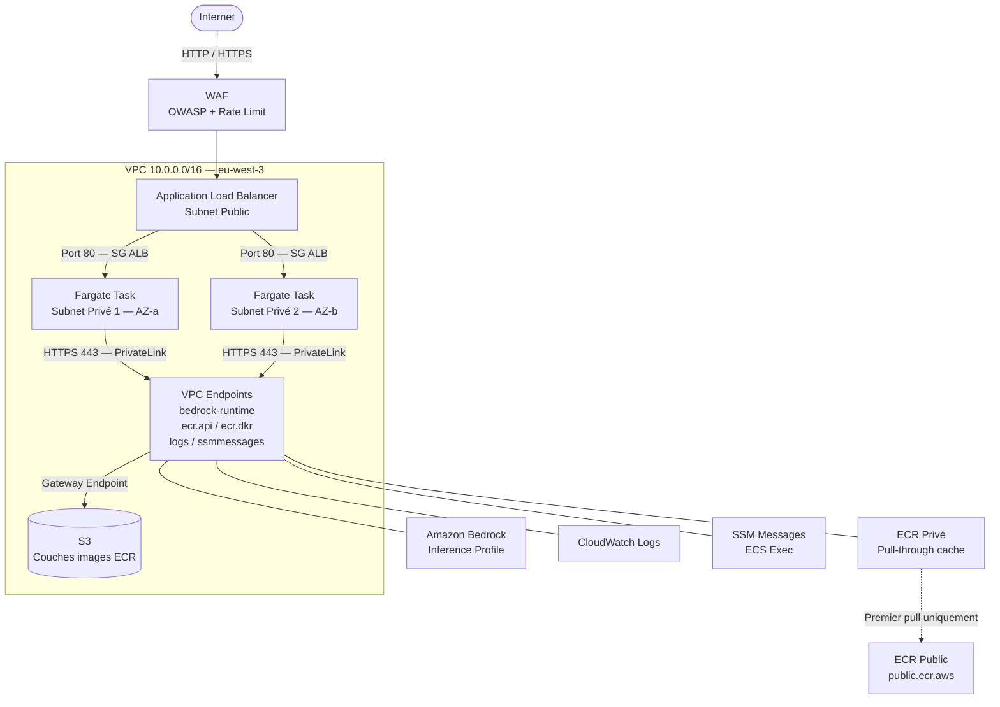

# AWS Secure AI Workload — ECS Fargate + Amazon Bedrock

## Executive Summary

Running AI inference on AWS introduces a surface area problem: the default path to model APIs goes through the public internet, which exposes traffic to interception, adds latency, and creates an uncontrolled cost vector — a single misconfigured endpoint hammered by a bot can generate thousands of Bedrock token charges before anyone notices.

This project provisions a production-grade AWS infrastructure that routes all AI inference traffic exclusively through AWS PrivateLink — no NAT gateway, no public IPs on compute, no outbound internet from the workload. The application runs on ECS Fargate (serverless containers) behind a WAF-protected ALB, calls Amazon Bedrock via a private VPC endpoint, and exposes per-inference cost visibility through a tagged inference profile.

It is also a deliberate refactoring exercise: the starting point was a classic "secure VPC" pattern (bastion host + EC2 + RDS). Every component was re-evaluated against two questions — does it justify its attack surface, and does it justify its cost?

**What was removed and why:**

| Removed | Replaced by | Reason |
|---|---|---|
| Bastion host | ECS Exec (SSM) | Eliminates SSH, port 22, key management |
| EC2 app instance | ECS Fargate | No OS patching, no instance lifecycle, pay-per-use |
| RDS MySQL | *(nothing)* | No relational requirement; persistent cost with no workload |
| NAT Gateway | VPC Interface Endpoints | Egress stays within AWS backbone; no internet exposure |

---

## Architecture Overview



**Flux de débogage (sans SSH) :**
```
aws ecs execute-command --cluster <cluster> --task <id> \
  --container app --interactive --command /bin/sh
```
Le canal passe par l'endpoint `ssmmessages` — aucun port ouvert, aucune clé SSH.

---

## Design Decisions

| Decision | Rationale |
|---|---|
| **ECS Fargate over EC2** | Supprime la gestion du cycle de vie des instances (patching, AMI, monitoring OS). La facturation à la seconde d'utilisation correspond au profil d'un workload IA à charge variable. |
| **VPC Interface Endpoints (PrivateLink) over NAT Gateway** | Le trafic vers Bedrock, ECR, CloudWatch et SSM ne quitte jamais le réseau AWS. Surface d'attaque réduite, pas de route par défaut vers internet dans les subnets privés. Coût comparable à un NAT gateway pour ce volume de services. |
| **Gateway Endpoint S3 (gratuit)** | Les couches d'images Docker stockées par ECR sont sur S3. Sans ce gateway, le pull d'image échoue même si les endpoints ECR sont présents — erreur silencieuse difficile à diagnostiquer. |
| **ECR pull-through cache over pull direct** | ECR Public (`public.ecr.aws`) n'est pas accessible via les VPC endpoints. Un pull direct depuis un VPC sans NAT produit une `CannotPullContainerError`. Le pull-through cache transforme une image publique en image privée, accessible via les endpoints existants. |
| **WAF rate-based rule** | Double rôle : protection sécurité (brute force, DDoS L7) et protection financière. Un bot qui martèle l'endpoint déclenche des appels Bedrock facturés au token — le rate limit coupe le flux avant que la facture explose ("denial of wallet"). |
| **Execution role / Task role séparés** | L'execution role est utilisé par ECS pour démarrer la tâche (pull image, écrire les logs). Le task role est utilisé par l'application dans le conteneur. En cas de compromission de l'app, l'attaquant obtient les permissions du task role (scoped), pas celles de l'execution role. |
| **Bedrock Application Inference Profile** | Sans inference profile, tous les appels Bedrock apparaissent comme une ligne générique dans Cost Explorer. Le profil taggé (`Project`, `CostCenter`) permet une ventilation du coût par workload sans instrumentation custom. |
| **ECS Exec over bastion** | Le bastion expose un port 22 permanent, nécessite des clés SSH distribuées, et crée une cible d'attaque dans le subnet public. ECS Exec ouvre un canal chiffré via SSM uniquement à la demande, sans port ouvert. |
| **Deployment circuit breaker with rollback** | Si une nouvelle version de la task definition échoue les health checks ALB, ECS revient automatiquement à la révision précédente. Évite une indisponibilité prolongée lors d'un deploy raté. |
| **ALB public subnet — Fargate private subnet** | L'ALB absorbe le trafic public et y applique le WAF avant de relayer vers Fargate. Les tâches n'ont aucune IP publique et aucune route internet. Seul l'ALB est exposé. |

---

## Traffic Flow

```
[Client]
   │
   ▼
[WAF — Web ACL]          ← OWASP rules + Known Bad Inputs + Rate limit (100 req/5min/IP)
   │
   ▼
[ALB — subnet public]    ← Health checks, listener HTTP:80
   │
   ▼
[Security Group ALB]     ← Ingress 80/443 internet → Egress 80 vers sg_fargate uniquement
   │
   ▼
[Fargate Tasks]          ← Multi-AZ (AZ-a + AZ-b), no public IP, sg_fargate
   │
   ├──► [ecr.api + ecr.dkr endpoints]  → Pull image (manifeste + couches via S3)
   ├──► [bedrock-runtime endpoint]     → Appel modèle via inference profile
   ├──► [logs endpoint]                → Écriture CloudWatch Logs
   └──► [ssmmessages endpoint]         → Canal ECS Exec (debug)
```

---

## Security Groups

Three security groups, chained with no overlap:

| SG | Ingress | Egress |
|---|---|---|
| `sg_alb` | 80/443 depuis `0.0.0.0/0` | 80 vers `sg_fargate` uniquement |
| `sg_fargate` | 80 depuis `sg_alb` uniquement | 443 vers `sg_endpoints` uniquement |
| `sg_endpoints` | 443 depuis `sg_fargate` uniquement | *(aucun)* |

Une tâche Fargate compromise ne peut pas atteindre internet ni un autre service non-endpoint.

---

## IAM — Least Privilege

**Execution Role** (`ecs-task-execution`) — utilisé par ECS, pas par l'app :
- `AmazonECSTaskExecutionRolePolicy` (managed) — pull ECR + logs CloudWatch
- `ecr:BatchImportUpstreamImage` + `ecr:CreateRepository` sur `ecr-public/*` — pull-through cache au premier pull

**Task Role** (`ecs-task`) — utilisé par l'application dans le conteneur :
- `ssmmessages:*` (4 actions) — ECS Exec uniquement
- *(Bedrock à ajouter lors du swap vers l'app réelle)*

---

## Cost Controls

| Mécanisme | Protection |
|---|---|
| WAF rate-based rule (100 req/5min/IP) | Limite les appels Bedrock induits par du trafic abusif |
| AWS Budget (alerte à 80% du seuil) | Notification avant dépassement du budget mensuel |
| Bedrock inference profile taggé | Ventilation du coût par requête dans Cost Explorer |
| Fargate (facturation à la seconde) | Pas de coût fixe pour des instances inutilisées |
| Gateway Endpoint S3 (gratuit) | Zéro frais de transfert pour les couches d'images ECR |

---

## File Structure

```
versions.tf          required_providers — aws ~> 5.0
providers.tf         provider aws + default_tags globaux
variables.tf         réseau / conteneur / monitoring
network.tf           VPC, subnets, IGW, route tables
security_groups.tf   sg_alb / sg_fargate / sg_endpoints
endpoints.tf         5 interface endpoints + gateway S3
ecr.tf               pull-through cache ECR Public → privé
iam.tf               execution role + task role
ecs.tf               cluster + task definition + service
alb.tf               ALB + target group ip + listener HTTP
waf.tf               Web ACL (OWASP + Known Bad + rate limit)
monitoring.tf        log group + budget + inference profile
outputs.tf           alb_url, ecs_exec_command, ...
```

---

## Deployment

**Prerequisites**

- AWS CLI configured (`aws configure` or IAM role)
- Terraform >= 1.5
- AWS account with Bedrock model access enabled in `eu-west-3`

**1. Create `terraform.tfvars`** (not committed)

```hcl
budget_alert_email = "your@email.com"
# Optional overrides:
# budget_limit_usd  = "50"
# bedrock_model_id  = "anthropic.claude-3-haiku-20240307-v1:0"
# app_desired_count = 1
```

**2. Deploy**

```bash
terraform init
terraform plan
terraform apply
```

**3. Validate**

```bash
# URL output after apply
curl http://<alb_url>
# Expected: nginx 200

# Connect to a running container (no SSH required)
aws ecs execute-command \
  --cluster <ecs_cluster_name> \
  --task <TASK_ID> \
  --container app \
  --interactive \
  --command /bin/sh \
  --region eu-west-3
```

**4. Enable cost allocation tags** (one-time, AWS Console)

Billing → Cost Allocation Tags → activate `Project` and `CostCenter`.
Required for the inference profile to appear as a separate line in Cost Explorer.

**5. Swap to the real app**

In `ecr.tf`, update `local.nginx_image_uri` with the production image URI.
Adjust `var.container_port` and `var.bedrock_model_id` as needed.
In `iam.tf`, add `bedrock:InvokeModel` on the inference profile ARN to the task role.

---

## Why This Project Matters

The classic "secure VPC" pattern — bastion, EC2, RDS — is a reasonable starting point but carries hidden costs: permanent attack surface (port 22), OS patching burden, and fixed database charges regardless of usage.

This project demonstrates that the same security posture can be achieved with a smaller attack surface and a lower cost floor by aligning architecture choices with workload characteristics:

- **Operational ownership is enforced architecturally.** No SSH keys to rotate, no bastion to monitor. Debug access is audited through SSM session logs automatically.
- **The cost model matches the usage model.** Fargate bills per second of execution. An inference profile makes Bedrock costs attributable per workload, not just per account.
- **Egress control is non-negotiable for AI workloads.** Routing model calls through the public internet is a data exposure risk. PrivateLink keeps inference traffic inside the AWS network with no configuration drift possible.
- **Cost protection is a security concern.** Rate limiting at the WAF layer is the first line of defence against unbounded token consumption — a class of risk specific to LLM-backed endpoints.

The architecture is designed to be extended: swap the nginx test image for a Python app, add `bedrock:InvokeModel` to the task role, and the full inference pipeline is operational without touching the network or security layer.
